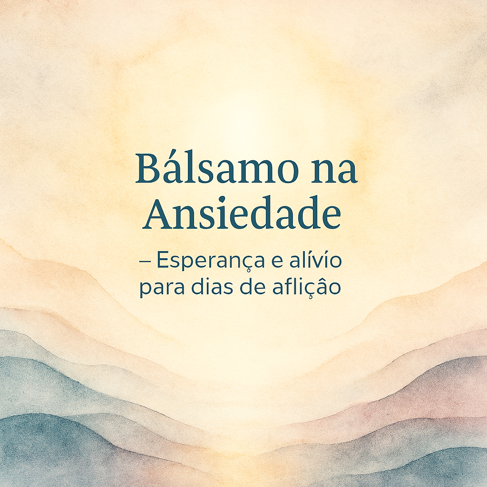

## 🌟 README - Prompts para Podcast de IA Generativa

    🎧 Preview do Podcast

    <audio src="output/podcast_editado.MP3" controls title="Podcast editado"></audio>

---

# 🎙️ Projeto Podcast Gerado por I.A.s

> ℹ️ **Nota:** Este repositório foi desenvolvido como parte do **Bootcamp Universia - Fundamentos de IA Generativa** da [DIO](https://dio.me). O projeto utiliza **inteligência artificial generativa** para criar um produto completo: roteiro, áudio e capa de um podcast, todos gerados por diferentes modelos de IA.

O objetivo é demonstrar como uma sequência estruturada de prompts pode guiar IAs na criação de cada etapa de um podcast, com foco no tema **ansiedade sob a perspectiva cristã**.

---

## 🔗 Links Úteis

- 🎧 [Ouvir o Podcast](./audio/Podcast_EP01.MP3)  
- 🖼️ [Ver Capa do Podcast](./assets/cover.png)

---

## 💻 Tecnologias Utilizadas

- [ChatGPT](https://chat.openai.com/) → Criação de roteiro e sugestões de nomes, a partir dos prompts.
- [MidJourney](https://www.midjourney.com/app/) → Geração da arte de capa.
- [ElevenLabs](https://beta.elevenlabs.io/) → Conversão do roteiro em áudio com voz sintética.
- [Capcut](https://www.capcut.com/pt-br/) → Edição final, mixagem e inserção de trilha sonora.

---

## ✨ Etapas do Projeto

1. **Roteiro e Nomes:**  
   Prompts detalhados foram criados com o **Microsoft Copilot** e executados no **ChatGPT** para gerar:  
   - Sugestões criativas de nomes para o podcast.  
   - Roteiro completo do episódio, seguindo estrutura e tom definidos.
   - Nome definido: "Bálsamo na Ansiedade – Esperança e alívio para dias de aflição!"  

2. **Áudio:**  
   O roteiro foi transformado em áudio de alta qualidade utilizando o **ElevenLabs**.  

3. **Arte:**  
   Um prompt específico foi usado no **MidJourney** para gerar a capa do podcast.  

4. **Edição Final:**  
   O áudio bruto foi combinado com música de fundo e editado no **Capcut**, resultando no produto final.  

---

## 📝 Prompts Base do Projeto

- 📂 [Abrir pasta de prompts](./src/prompts) 
- 🎙️ [Prompt de roteiro](./src/prompts/copilot.md)
- 🎙️ [Prompt de roteiro](./src/prompts/midjourney.md)    

